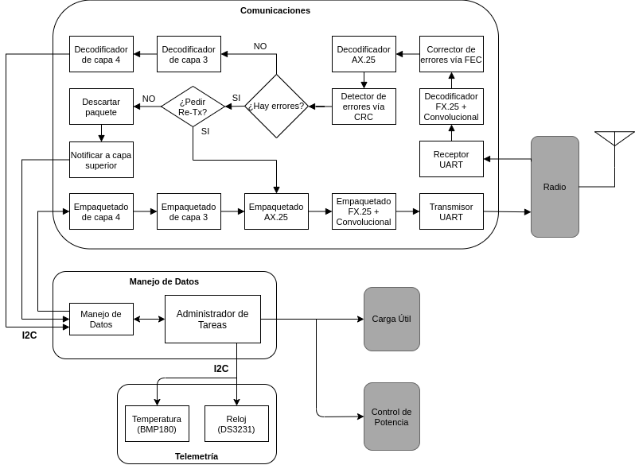

# Odiseo's Flight Software

Flight software developed as a telematics bachelor's thesis at [UPIITA-IPN](https://www.upiita.ipn.mx/).

The goal of this project is make up a proof-of-concept of a main computer meant to control a TubeSat with a memory to store/retrieve messages as a payload.

The computer is made of two MSP430 chips (programmed in native C). One chip called [main_computer](/main_computer) is in charge of all the processing and the other chip [comms_computer](/comms_computer) is in charge of receiving and transmitting FX.25 frames. Both computers are communicated via I2C ports and the [comms_computer](/comms_computer) is plugged to a dipole antenna (following the TubeSat recommendations) via the USART port.

This proof-of-concept considers the following basic tasks:

* Command Processing (for the list of commands see [main_computer](/main_computer))
* Send Telemetry
* Store/send logs
* Power management (this is left blank as it was meant to be developed by a different team in a different thesis)

Which are carried out along 5 tasks by a task's scheduler based on RIOS in the [main_computer](/main_computer) and the relation between both chips is depicted in the following diagram:

More information about the tasks can be found in [main_computer](/main_computer) additionay with a `Makefile` to program the chip using Energia in MacOS.

## References

* Miller, B., Vahid, F., & Givargis, T. (2013). RIOS. Proceedings of the Workshop on Embedded and Cyber-Physical Systems Education - WESE ’12. the Workshop. https://doi.org/10.1145/2530544.2530553

* Reference to Windows/Unix blankspaces:
https://stackoverflow.com/questions/5834014/lf-will-be-replaced-by-crlf-in-git-what-is-that-and-is-it-important

## License

Licensed under the [MIT License](/LICENSE).