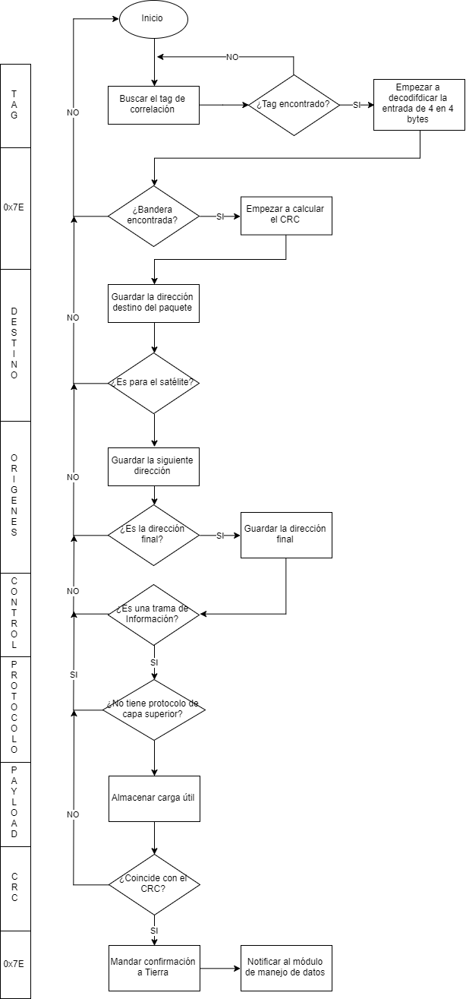

# Odiseo's Receive/Transmit Software

Flight software of the in charge of transmit/receive. Including functions to check and correct errors with CRC

## Features

* Implements a state machine to process FX.25 frames via the UART port and replies with a confirmation
* Notifies the [main_computer](/main_computer) that transmission mode is ready with a HIGH pin
* Notifies the [main_computer](/main_computer) that valid frames were received so they can be processed
* Valid frames are sent to the [main_computer](/main_computer) for processing via I2C
* Watchdog is enabled

The main function is depicted by the following diagram:

